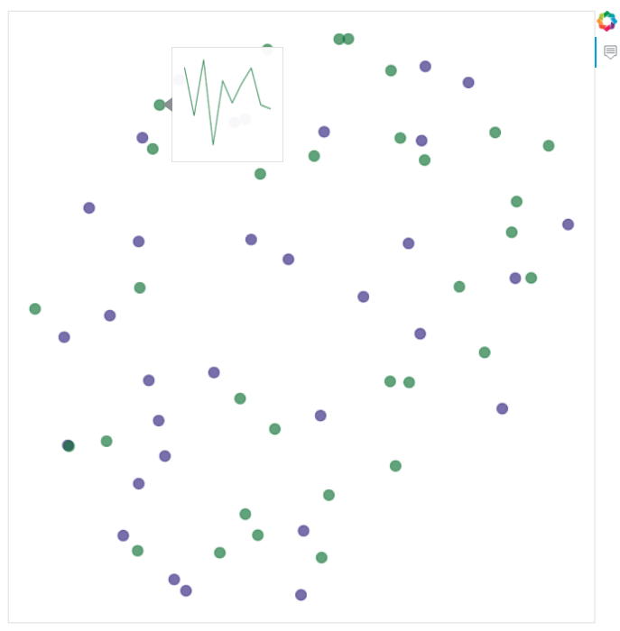

# filter1D_visualization

Automatically generate a html (`index.html`) page showing a 2D space of 1D convolution-based filters as usually used in [Deep Learning for Time Series Classification](https://msd-irimas.github.io/pages/dl4tsc/). It is mainly based on [Bokeh library](https://github.com/bokeh/bokeh) and [Aeon](https://github.com/aeon-toolkit/aeon).


## Usage

```
python main.py --models M [M ...] --layers L [L ...] [--distance D] [--outdir OUTDIR] [--title TITLE]
```
With:
- `M`: a list of Deep model paths
- `L`: a list of layer indexes in corresponding models
- `D`: a distance to compare filters among available distances in [Aeon](https://www.aeon-toolkit.org/en/stable/api_reference/distances.html)
- `OUTDIR`: output directory to generate the html file (default: `out/`)
- `TITLE`: title of the html page (default: 'Filter visualization')


## Example

```
python main.py --models example/lite_car_0.hdf5 example/lite_car_1.hdf5 --layers -5 -5
```
This generates [this html file](https://maxime-devanne.com/pages/filter1D_visualization/), visualizing filters from the last conv layer of two different [Lite classifiers](https://github.com/MSD-IRIMAS/LITE/) trained on Car dataset.

<p align="center">

</p>
