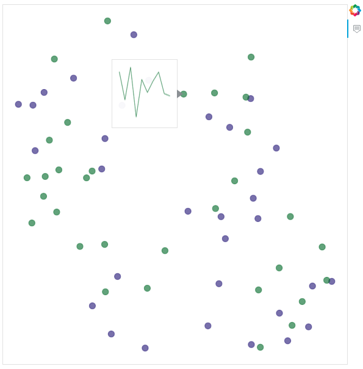

# 2D Visualization of Convolution Filters on Time Series Data

This repository automatically generates an HTML (`index.html`) page showcasing a 2D space of 1D convolution-based filters, a common technique employed in Deep Learning for Time Series Classification. Inspired by the techniques outlined in [Deep Learning for Time Series Classification](https://msd-irimas.github.io/pages/dl4tsc/), this tool leverages the power of the [Bokeh library](https://github.com/bokeh/bokeh) and [Aeon toolkit](https://github.com/aeon-toolkit/aeon) to visualize these filters in an interactive and intuitive manner. Explore the spatial arrangement of filters and gain insights into their distribution, aiding in model understanding and interpretation.


## Requirements

```
tensorflow
numpy
hydra-core
aeon
scikit-learn
bokeh
bs4
matplotlib
```

## Usage

This code utilizes the hydra configuration setup, simply edit the parameters of the configuration file ('config/config_hydra.yaml`) and run the following:

```
python main.py
```

The different parameters include:

- `output_directory`: The output directory where the results are stored
- `model_paths`: A list of model paths to use, make sure to use the absolute path.
PS: make sure you use `.keras` not `.hdf5` files if you are tf >= 2.15
- `layer_indices`: a list of layer indices in corresponding models
- `list_labels`: a list of labels for each of the models
- `list_colors`: a list of colors in HEX code, if None used colors are randomly generated
- `distance`: a distance to compare filters among available distances in [Aeon](https://www.aeon-toolkit.org/en/stable/api_reference/distances.html) (default: 'dtw')
- `title`: title of the html page (default: 'Filter 2D Visualization')


## Example

We present below the generated figure of our code using the example models stored in `example/`.

This generates [this html file](https://maxime-devanne.com/pages/filter1D_visualization/), visualizing filters from the last conv layer of two different [Lite classifiers](https://github.com/MSD-IRIMAS/LITE/) trained on Car dataset.

<p align="center">

</p>
